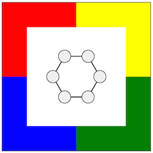

Four-Colorable
==============

A game about coloring graphs made in JavaScript. The player clicks and drags vertices into color regions to color them, a level is complete when the graph is properly colored!

 
